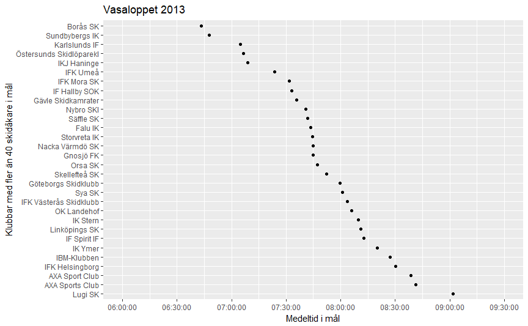
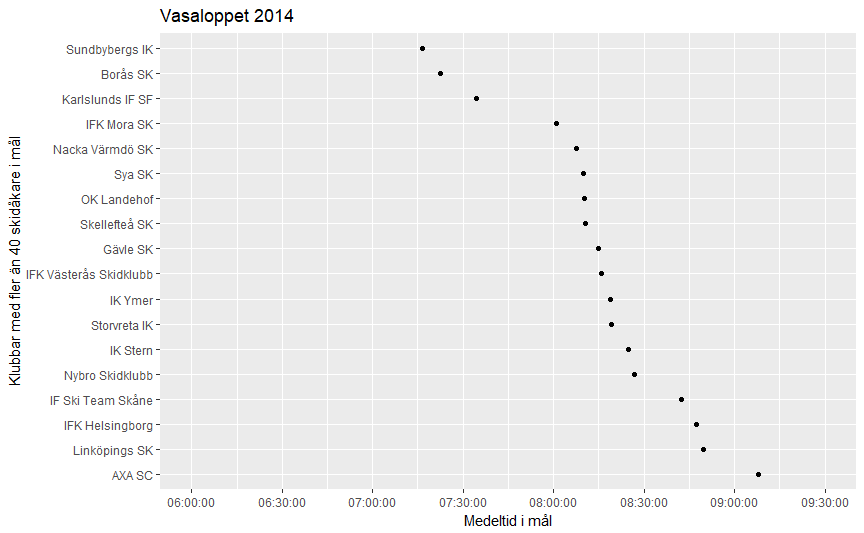
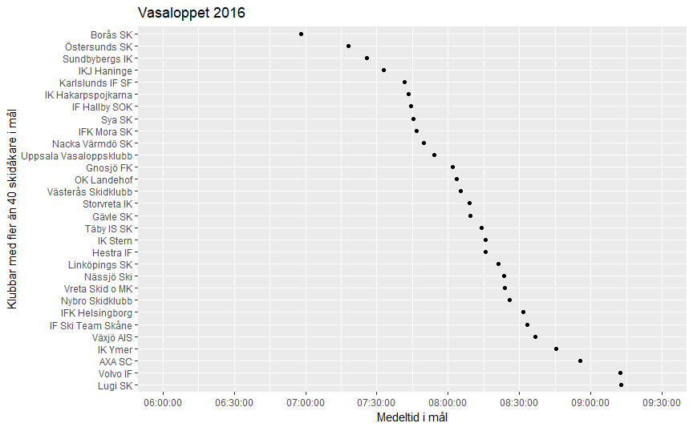
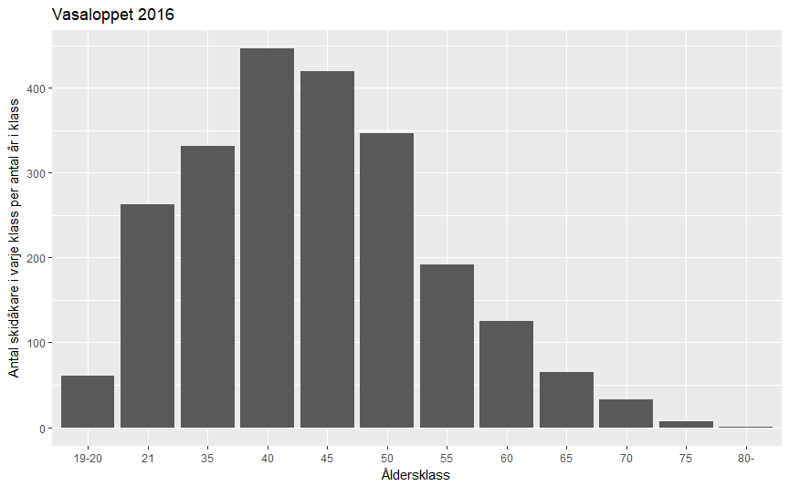
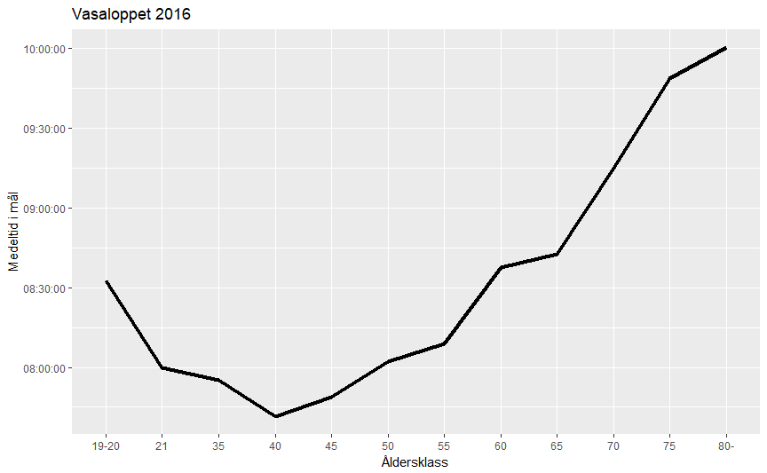
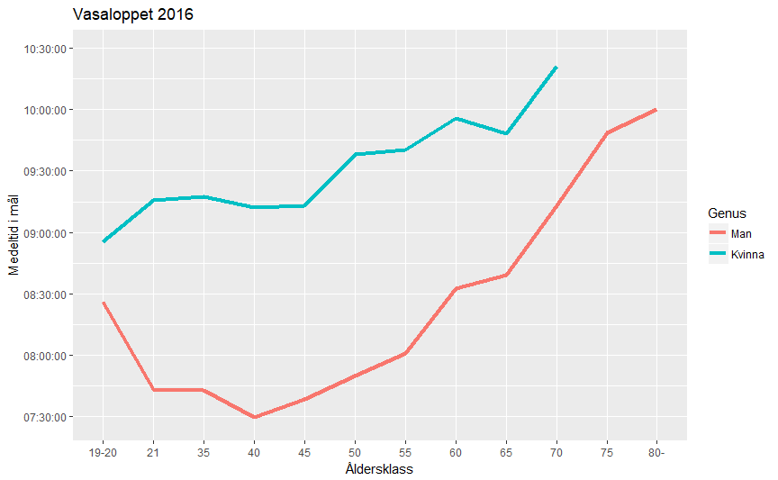
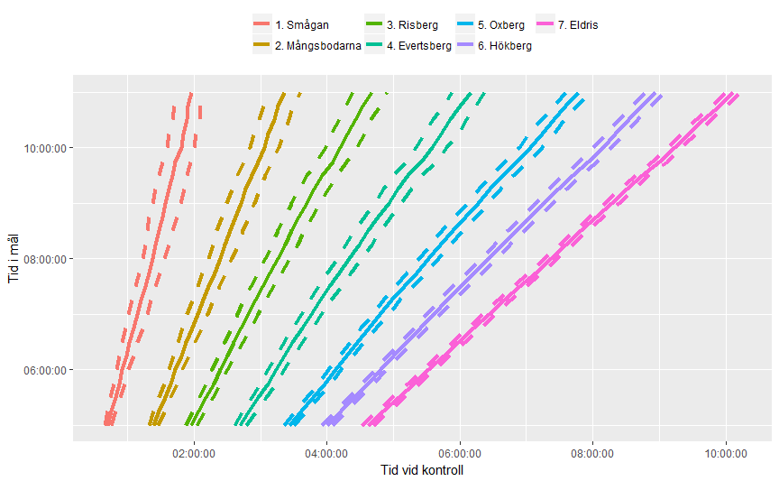
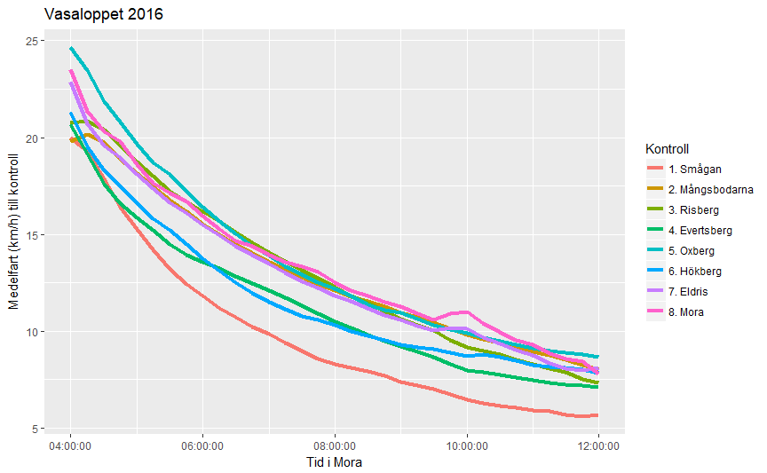
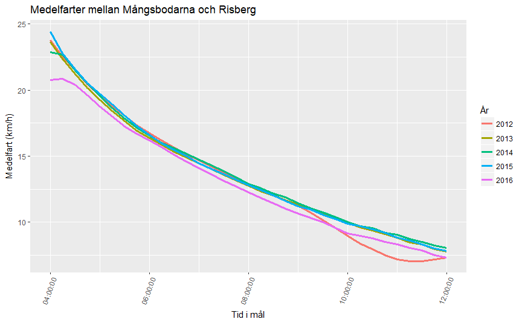
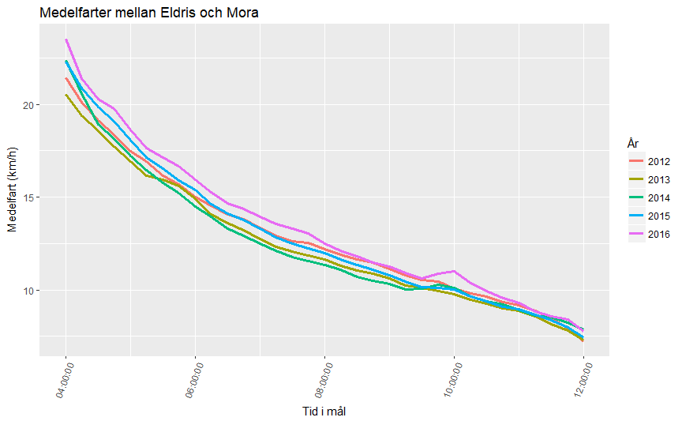

Vasaloppet - Mellantidsrekommendationer
================
Olof Rännbäck Garpinger, Knightec AB, <olof.rannbackgarpinger@knightec.se>,
28 February, 2018

Förord
------

Denna rapport sammanfattar data från Vasaloppen mellan åren 2012 och 2016. **Främsta målet är att presentera mellantidsrekommendationer givet en önskad övre sluttid.** Det vill säga, att med hjälp av enkla samband ge vasaloppsåkare tidsintervall inom vilka de bör nå kontrollerna i Smågan, Mångsbodarna, Risberg, Evertsberg, Oxberg, Hökberg, och Eldris, om de vill nå Mora innan en viss sluttid. Dessa föreslagna mellantider presenteras i tabeller i [kapitel 5](#mellantidsrekommendationer).

Typiska hastighetsprofiler för vasaloppsåkare med närliggande sluttider har också tagits fram, i jämförelse med medelhastigheten för övriga åkare med liknande målgångstider. Utöver detta kommer jag även att försöka besvara bl.a. följande frågor:

-   Vilka klubbar (med fler än 40 deltagare) har bäst snittider i respektive lopp?
-   Hur är sluttiderna fördelade från år till år, och från startgrupp till startgrupp?
-   Vilka åldersgrupper har störst representation i startfältet?
-   Hur varierar medeltid i mål över åldersgrupperna? Mellan kvinnor och män?
-   Kan man hitta några mönster eller avvikelser i skidåkarnas hastighet beroende på år och sluttid?

Denna rapport innehåller ingen granskning eller härledning av mellantidsrekommendationerna. Detta för att rapporten inte ska bli dubbelt så lång eller alltför svårläst för gemene skidåkare. Inom kort kommer jag dock lägga upp en andra version av rapporten (på samma github) som även innehåller härledningar, statistiska tester av mellantidsrekommendationerna, samt R-kod för att generera allt. Då kommer jag även att tillhandahålla något modifierade dataset för den som själv vill prova på att programmera.

Data har hämtats från den numera nedlagda sajten resultatjakt.se, och innehåller bland annat namn, klubbar, mellantider, och sluttider, på skidåkare som tagit sig i mål. All data som presenteras här har dock anonymiserats för att man inte ska kunna urskilja enskilda personers prestationer. Syftet med rapporten är inte heller att belysa enskilda åkares bedrifter, utan att ta fram statistik och hitta mönster hos större grupper av skidåkare, som t.ex. de med närliggande sluttider.

*Notera att denna rapport inte kan kopplas till Vasaloppsarrangören på något sätt, den är framtagen helt på eget bevåg av undertecknad.*

#### Vem är jag?

Jag heter Olof Rännbäck-Garpinger och är en sportintresserad skåning, dock helt utan Vasaloppsmeriter. Längdskidor åker jag endast när det finns tillräckligt med snö i södra Sverige, och det händer tyvärr alltför sällan. Min yrkesmässiga bakgrund ligger inom ingenjörsyrket och jag är reglerteknisk specialist. Sedan 2016 brinner jag för Data Science (<https://en.wikipedia.org/wiki/Data_science>), och denna rapport är en del av mitt lärande inom ämnet. Mina Vasaloppsstudier började först som ett hobbyprojekt, men har sedan övergått till ett mindre projekt på arbetet.

#### Programmering

Rapporten har skrivits i R Markdown där figurer och tabeller har genererats med hjälp av R-kod. R är ett programmeringsspråk som används för t.ex. statistiska analyser, beräkningar, datahantering, visualiseringar, och maskininlärning.

#### English please?

This report explores data from Vasaloppet from 2012 to 2016. It is part of the author's learning project in Data Science. So far, there are no plans to translate the report to English, but this could change if there is enough interest for it. So, if you wish that I translate the report, please send me an e-mail (<olof.rannbackgarpinger@knightec.se>) with a translation request.

#### Tack!

Jag skulle vilja rikta ett stort tack till Erik Hallengren som har gett mig såväl inspiration till detta arbete, som tillgång till data.

Jag vill också tacka min arbetsgivare Knightec AB, samt min chef Viveca Selander, för att jag fått möjlighet att lära mig mer om R och jobba med denna rapport.

Sist men inte minst är jag mycket tacksam över att mina kollegor Josefin Berner, Jonas Dürango, och Pierre Landén hjälpt mig med feedback, samt att färdigställa rapporten.

Innehållsförteckning
--------------------

[Förord](#förord)

[1. Vasaloppsdata](#vasaloppsdata)

[2. Mellantider och sluttider från år till år](#mellantider-och-sluttider-från-år-till-år)

[3. Sammanställning av klubbars medeltider i mål](#sammanställning-av-klubbars-medeltider-i-mål)

[4. Medeltider för skidåkare i olika åldersklasser](#medeltider-för-skidåkare-i-olika-åldersklasser)

[5. Mellantidsrekommendationer](#mellantidsrekommendationer)

[6. Hastigheter för skidåkare med liknande tid i mål](#hastigheter-för-skidåkare-med-liknande-tid-i-mål)

**1. Vasaloppsdata**
--------------------

Data från samtliga Vasalopp mellan 2012 och 2016 finns lagrade i csv-filer, vilket i princip betyder att den ligger sparad i fem stycken tabeller. En rad i data anger en enskild skidåkares personuppgifter (namn, klubb, startnummer, etc.) och prestation (mellantider och sluttid). Samtliga uppifter som skulle kunna peka ut enskild skidåkare har dock anonymiserats i denna rapport då jag endast är intresserad av titta på kollektiva mönster.

Samtliga datafiler innehåller tillsammans information om 66493 stycken Vasaloppsbedrifter (där vissa åkare återkommer från år till år). Varje dataset innehåller skidåkar-ID, Vasaloppsår, mellantider och sluttider i sekunder, det vill säga som i tabellen här nedan. Endast skidlöpare som gått i mål är med i data.

|  Skidåkare| År   |  Smågan (sek)|  Mångsbodarna (sek)|  Risberg (sek)|  Evertsberg (sek)|  Oxberg (sek)|  Hökberg (sek)|  Eldris (sek)|  Mora (sek)|
|----------:|:-----|-------------:|-------------------:|--------------:|-----------------:|-------------:|--------------:|-------------:|-----------:|
|          1| 2012 |          3284|                5671|           7939|             10855|         13761|          16165|         18685|       20969|
|          2| 2012 |          3943|                6570|           9279|             12382|         15837|          18540|         21348|       23575|
|          3| 2012 |          6547|               11389|          16551|             21165|         26420|          30531|         34500|       38165|
|          4| 2012 |          4938|                9072|          12602|             18017|         23161|          26344|         30105|       32954|
|          5| 2012 |          3516|                6541|           9011|             12170|         15625|          18381|         21113|       23383|

Om man beräknar tidsdifferensen mellan varje kontroll och lägger till uppgifter om avståndet mellan de olika kontrollerna kan man även få ut skidåkarnas fart mellan varje kontroll. I nästa tabell visas denna information (i km/h). Fart till *kontrollens namn* (exempelvis Smågan) relaterar till hastigheten mellan föregående kontroll och denna kontrollstation (t.ex. start till Smågan).

|  Skidåkare| År   |  Fart till Smågan (km/h)|  Fart till Mångsbodarna (km/h)|  Fart till Risberg (km/h)|  Fart till Evertsberg (km/h)|  Fart till Oxberg (km/h)|  Fart till Hökberg (km/h)|  Fart till Eldris (km/h)|  Fart till Mora (km/h)|
|----------:|:-----|------------------------:|------------------------------:|-------------------------:|----------------------------:|------------------------:|-------------------------:|------------------------:|----------------------:|
|          6| 2012 |                    18.74|                          20.17|                     21.03|                        18.66|                    22.02|                     17.31|                    17.40|                  18.93|
|          7| 2012 |                     6.31|                          13.87|                     13.13|                        10.89|                    10.50|                      8.83|                    10.69|                  10.40|
|          8| 2012 |                     6.27|                          12.49|                     12.13|                         9.31|                    12.17|                      9.12|                    10.70|                  11.95|
|          9| 2012 |                    10.33|                          15.01|                     14.31|                        11.82|                    13.61|                     10.07|                    11.60|                  12.48|
|         10| 2012 |                    14.16|                          18.87|                     20.60|                        16.16|                    21.60|                     15.79|                    17.50|                  20.21|

Sluttiderna (alltså tiderna i Mora) har även delats in i ett antal tidsgrupper om 15 minuter mellan varje. En grupp är t.ex. den med sluttider mellan 06:45:00 (timmar, minuter, sekunder) och 07:00:00. Denna grupp kommer jag fortsättningvis kalla gruppen som är i mål innan 07:00:00, t.ex. i mellantidsrekommenderingen i [kapitel 5](#mellantidsrekommendationer).

I data från 2016 finns även uppgifter om genus (Man/Kvinna), åldersgrupp (12 grupper: 19-20, 21, 35, 40, 45, 50, 55, 60, 65, 70, 75, 80-), och startgrupp (11 grupper från 0-10, där 0 är högst rankat och 10 är lägst rankat). Om jag tolkat åldersgrupperna korrekt så innehåller t.ex. grupp 21 alla åkare mellan 21 och 34 år, och så vidare.

|  Skidåkare|    År| Genus  | Åldersklass | Startgrupp |
|----------:|-----:|:-------|:------------|:-----------|
|          1|  2016| Kvinna | 50          | 8          |
|          2|  2016| Man    | 21          | 5          |
|          3|  2016| Man    | 21          | 1          |
|          4|  2016| Kvinna | 21          | 10         |
|          5|  2016| Man    | 50          | 2          |

Dessa uppgifter används nedan för att göra en lite mer utförlig analys av 2016 års data. Dessutom kan man beräkna hur mycket snabbare eller långsammare en skidåkare har åkt relativt övriga åkare i samma startgrupp. D.v.s. avgöra hur väl de har åkt jämfört med andra åkare som har liknande ambitionsnivå. Denna information har använts för att analysera mönster i skidåkarnas hastighetsprofiler (se [kapitel 6](#hastigheter-för-skidåkare-med-liknande-tid-i-mål)).

[Åter till innehållsförteckningen](#innehållsförteckning)

**2. Mellantider och sluttider från år till år**
------------------------------------------------

Tabellen nedan innehåller uppgifter om hur medeltider vid varje kontroll och mål (i Mora) har varierat från år till år (i timmar:minuter:sekunder). Notera att endast skidåkare som tagit sig i mål funnits med i dessa uträkningar.

| År   | Smågan (sek) | Mångsbodarna (sek) | Risberg (sek) | Evertsberg (sek) | Oxberg (sek) | Hökberg (sek) | Eldris (sek) | Mora (sek) |
|:-----|:-------------|:-------------------|:--------------|:-----------------|:-------------|:--------------|:-------------|:-----------|
| 2012 | 01:10:09     | 02:02:34           | 02:47:16      | 03:43:35         | 04:45:45     | 05:31:51      | 06:19:45     | 06:59:31   |
| 2013 | 01:14:09     | 02:09:51           | 02:59:13      | 04:03:55         | 05:12:02     | 06:03:44      | 06:55:53     | 07:40:41   |
| 2014 | 01:19:19     | 02:20:23           | 03:10:51      | 04:13:45         | 05:24:07     | 06:17:47      | 07:13:18     | 07:59:51   |
| 2015 | 01:14:57     | 02:15:47           | 03:09:11      | 04:21:40         | 05:40:23     | 06:38:41      | 07:37:01     | 08:23:30   |
| 2016 | 01:16:56     | 02:20:26           | 03:12:46      | 04:20:01         | 05:32:56     | 06:24:07      | 07:13:17     | 07:55:32   |

2012 års Vasalopp var således det snabbaste av de fem, faktiskt ända från Smågan till mål. Vasaloppet 2015 var långsammast och det verkar främst ha berott på förhållandena efter Risberg.

Figuren nedan visar hur många skidåkare som varje år gått i mål inom respektive 15-minutersintervall. Här ser vi t.ex. hur det 2012 var ovanligt många skidåkare med tider mellan 5 och 8 timmar. 2015 var det å andra sidan väldigt få som gick i mål innan 5-timmarsstrecket. En annan intressant detalj är att 2016 års fördelning har en rejäl topp strax innan 10 timmar. Frågan är vad det kan har berott på? Låt oss återkomma till detta längre fram i rapporten.

Nästa figur visar antalet skidåkare inom varje startgrupp som kommit i mål inom respektive 15-minutersintervall under 2016 års Vasalopp. Lägre startgrupper är mer välsamlade än de högre, vilket tyder på en mer samlad prestationsnivå hos de åkarna. Grupperna 8-10 har alla samma tydliga spik innan 10 timmar, som även syntes i föregående figur. Startgrupp 10 har för övrigt den klart största spridningen i sluttider, och man märker att många av skidlöparna i denna grupp egentligen borde ha tillhört en något lägre startgrupp. Gissningsvis de som inte ville eller hade möjlighet att få en bättre seedning.

[Åter till innehållsförteckningen](#innehållsförteckning)

**3. Sammanställning av klubbars medeltider i mål**
---------------------------------------------------

Data innehåller samtliga skidåkares klubbtillhörighet, och jag har därför valt att beräkna medeltider i mål för samtliga klubbar med fler än 40 deltagare i de enskilda loppen. Att gränsen dragits vid just 40 deltagare beror på att jag velat begränsa antalet klubbar i de fem figurerna nedan, som visar medeltiderna för varje klubb. I figurerna kan man se att klubbar från södra Sverige (som t.ex. Lugi SK, och IFK Helsingborg) och klubbar med företagsnamn (som Volvo IF, IBM-klubben, etc.) typiskt har lite sämre medeltider i mål. Exempel på prominenta klubbar är Borås SK, Östersunds skidlöpareklubb, IKJ Haninge, Sundbybergs IK, Karlslunds IF SF, och IFK Mora SK. Överlag är det många storstadsklubbar representerade, vilket inte är så oväntat.

[Åter till innehållsförteckningen](#innehållsförteckning)

**4. Medeltider för skidåkare i olika åldersklasser**
-----------------------------------------------------

Låt oss nu ta en titt på hur åldersfördelningen såg ut bland de som tog sig i mål i Vasaloppet 2016. Figuren nedan visar antalet skidlöpare i varje klass delat med antalet år åldersklassen spänner över. Åldersklassen *21* hade t.ex. 3676 skidlöpare som tog sig ända fram till Mora. Eftersom klassen spänner över 14 år (från 21-åringar till 34-åringar) så blir antalet skidåkare per antalet år i åldersklassen lika med 3676/14 = 262.6 stycken. Anledningen till denna indelning är att vissa åldersklasser spänner fler år än andra. Åldersklassen *80-* har jag för enkelhetens skull antagit spänna över 5 år, precis som de flesta övriga klasser.

Intressant nog kan man notera att det är flest deltagare i åldern 40-44 år. Är detta månne ett tecken på 40-årskris hos en del vasaloppsåkare? :-)

I nästa figur är åldersgrupperna även uppdelade mellan män och kvinnor. Dels kan man se att det är klart färre kvinnor som ställt upp, samt att de är mer jämnt fördelade över åldrarna 21 till 54 år.

Om man sammanställer medeltiderna för respektive åldersgrupp kan man också se att *40*-gruppen inte bara är den mest välrepresenterade gruppen, utan även har den bästa medeltiden av alla. Då ska man emellertid komma ihåg att det är många duktiga yngre skidåkare som fokuserar på världscupen snarare än långlopp som Vasaloppet.

För övrigt kan man notera att det är först efter 60 år som åldern på allvar tycks börja sätta begränsningar för hur snabbt man åker.

I nästa figur är medeltiderna även uppdelade efter kön. I snitt låg kvinnorna kring 1 timme och 40 minuter efter männen i samma åldersklasser.

Generellt sett ska man dock passa sig för att dra alltför långtgående slutsatser utifrån endast ett års Vasalopp (eller fem för den delen). Det kan finnas variationer mellan åren som man inte har information om.

[Åter till innehållsförteckningen](#innehållsförteckning)

**5. Mellantidsrekommendationer**
---------------------------------

I detta kapitel ges rekommendationer på lämpliga mellantider givet en viss önskad tid i mål. Rekommendationstabellerna nedan kan även användas för att, givet en viss mellantid, hitta andra lämpliga mellantider och sluttid att sikta in sig på. På så vis kan man få tips om hur man bäst lägger upp sitt resterande lopp.

I tabellerna anges en övre gräns för sluttiden ovanför tabellen. Antag t.ex. att det står *I mål innan 07:00:00*. Då gäller tabellen skidåkare som önskar ta sig i mål mellan 06:45:00 och 07:00:00. Första kolonnen i tabellen anger vilken kontroll det rör sig om. *Rekommenderad tid* anger den tid då skidåkaren rekommenderas ankomma till kontrollen. Denna har härletts genom att ta mediantiden för skidåkare med liknande tid i mål. *Undre tid* och *Övre tid* har valts så att de rymmer ungefär 75% av alla skidlöpares tider (av de som har samma sluttid). *Tidsfönster* är skillnaden mellan övre och undre tid.

Sluttiderna i tabellerna nedan sträcker sig mellan 05:00:00 och 11:00:00. Dessa gränser har valts därför att det är någorlunda många åkare (över de här fem åren) som har tagit sig i mål mellan dessa tider. Övriga sluttider är helt enkelt inte lika välrepresenterade i data.

För att få en överblick kan man rita ut de rekommenderade tiderna vid respektive kontroll, mot sluttiderna. Då får man figuren här nedan. Rekommenderade tider ges av heldragna linjer, undre och övre tider av streckade linjer. Så genom att se vilken sluttid man vill ha kan man gå in och läsa av i figuren inom vilka tidsintervall man bör vara vid respektive kontroll. Vill man ha noggrannare siffror än vad som går att läsa av i figuren får man titta i tabellerna nedan.

Om man granskar mellantiderna från år till år lite noggrannare kan man se att det kan variera en del vilka tider skidlöparna kommer in till kontrollerna, trots att de sedan får samma sluttider. Detta beror sannolikt på andra faktorer såsom vädret före och under loppet. Det är således inte hela världen ifall man missar något eller några tidsintervall. Faktum är att fler än 60% missar åtminstone ett intervall. Granskningen visar även att ungefär 75% av skidlöparna med en viss sluttid prickar in det uppritade tidsintervallet vid åtminstone fyra av sju kontroller. Missar man fler än så och ändå når sluttiden så kan man fråga sig själv ifall man verkligen har disponerat sitt lopp på bästa sätt.

**Notera att rekommendationstabellerna är härledda för riktiga Vasaloppet. De har inte testats på data från t.ex. öppet spår.**

#### I mål innan *05:00:00*

| Kontroll     | Undre tid | Rekommenderad tid | Övre tid | Tidsfönster |
|:-------------|:----------|:------------------|:---------|:------------|
| Smågan       | 00:39:28  | 00:42:09          | 00:45:30 | 00:06:02    |
| Mångsbodarna | 01:19:16  | 01:23:37          | 01:27:28 | 00:08:12    |
| Risberg      | 01:52:46  | 01:57:50          | 02:02:26 | 00:09:40    |
| Evertsberg   | 02:36:24  | 02:41:33          | 02:47:24 | 00:11:00    |
| Oxberg       | 03:21:38  | 03:26:07          | 03:30:33 | 00:08:55    |
| Hökberg      | 03:55:50  | 04:00:23          | 04:05:12 | 00:09:22    |
| Eldris       | 04:31:51  | 04:36:56          | 04:42:02 | 00:10:11    |

#### I mål innan *05:15:00*

| Kontroll     | Undre tid | Rekommenderad tid | Övre tid | Tidsfönster |
|:-------------|:----------|:------------------|:---------|:------------|
| Smågan       | 00:42:05  | 00:45:30          | 00:49:26 | 00:07:21    |
| Mångsbodarna | 01:23:46  | 01:28:24          | 01:33:20 | 00:09:34    |
| Risberg      | 01:59:00  | 02:04:07          | 02:09:39 | 00:10:39    |
| Evertsberg   | 02:43:53  | 02:49:49          | 02:55:51 | 00:11:58    |
| Oxberg       | 03:31:39  | 03:36:42          | 03:41:36 | 00:09:57    |
| Hökberg      | 04:07:29  | 04:12:48          | 04:17:43 | 00:10:14    |
| Eldris       | 04:45:22  | 04:50:58          | 04:55:52 | 00:10:30    |

#### I mål innan *05:30:00*

| Kontroll     | Undre tid | Rekommenderad tid | Övre tid | Tidsfönster |
|:-------------|:----------|:------------------|:---------|:------------|
| Smågan       | 00:44:47  | 00:48:55          | 00:53:38 | 00:08:51    |
| Mångsbodarna | 01:28:23  | 01:33:39          | 01:39:17 | 00:10:54    |
| Risberg      | 02:04:58  | 02:10:51          | 02:17:14 | 00:12:16    |
| Evertsberg   | 02:51:52  | 02:58:06          | 03:05:16 | 00:13:24    |
| Oxberg       | 03:42:08  | 03:47:12          | 03:52:23 | 00:10:15    |
| Hökberg      | 04:19:50  | 04:24:57          | 04:30:06 | 00:10:16    |
| Eldris       | 04:59:09  | 05:04:35          | 05:09:43 | 00:10:34    |

#### I mål innan *05:45:00*

| Kontroll     | Undre tid | Rekommenderad tid | Övre tid | Tidsfönster |
|:-------------|:----------|:------------------|:---------|:------------|
| Smågan       | 00:47:38  | 00:52:33          | 00:57:15 | 00:09:37    |
| Mångsbodarna | 01:33:17  | 01:39:09          | 01:44:45 | 00:11:28    |
| Risberg      | 02:11:39  | 02:17:58          | 02:23:48 | 00:12:09    |
| Evertsberg   | 02:59:48  | 03:06:36          | 03:13:51 | 00:14:03    |
| Oxberg       | 03:52:13  | 03:57:44          | 04:03:10 | 00:10:57    |
| Hökberg      | 04:31:53  | 04:37:12          | 04:42:21 | 00:10:28    |
| Eldris       | 05:12:53  | 05:18:19          | 05:23:51 | 00:10:58    |

#### I mål innan *06:00:00*

| Kontroll     | Undre tid | Rekommenderad tid | Övre tid | Tidsfönster |
|:-------------|:----------|:------------------|:---------|:------------|
| Smågan       | 00:50:01  | 00:55:10          | 01:01:02 | 00:11:01    |
| Mångsbodarna | 01:36:54  | 01:43:13          | 01:49:43 | 00:12:49    |
| Risberg      | 02:16:45  | 02:23:32          | 02:29:59 | 00:13:14    |
| Evertsberg   | 03:06:53  | 03:14:14          | 03:21:24 | 00:14:31    |
| Oxberg       | 04:01:36  | 04:07:34          | 04:13:06 | 00:11:30    |
| Hökberg      | 04:43:34  | 04:48:47          | 04:53:49 | 00:10:15    |
| Eldris       | 05:26:44  | 05:31:41          | 05:36:47 | 00:10:03    |

#### I mål innan *06:15:00*

| Kontroll     | Undre tid | Rekommenderad tid | Övre tid | Tidsfönster |
|:-------------|:----------|:------------------|:---------|:------------|
| Smågan       | 00:52:44  | 00:58:49          | 01:05:45 | 00:13:01    |
| Mångsbodarna | 01:40:59  | 01:48:18          | 01:55:29 | 00:14:30    |
| Risberg      | 02:22:15  | 02:29:51          | 02:37:18 | 00:15:03    |
| Evertsberg   | 03:14:06  | 03:21:44          | 03:29:32 | 00:15:26    |
| Oxberg       | 04:11:18  | 04:17:16          | 04:23:12 | 00:11:54    |
| Hökberg      | 04:54:58  | 05:00:15          | 05:05:44 | 00:10:46    |
| Eldris       | 05:39:41  | 05:45:20          | 05:50:37 | 00:10:56    |

#### I mål innan *06:30:00*

| Kontroll     | Undre tid | Rekommenderad tid | Övre tid | Tidsfönster |
|:-------------|:----------|:------------------|:---------|:------------|
| Smågan       | 00:55:07  | 01:01:50          | 01:09:12 | 00:14:05    |
| Mångsbodarna | 01:45:19  | 01:52:39          | 02:00:53 | 00:15:34    |
| Risberg      | 02:27:52  | 02:35:34          | 02:43:47 | 00:15:55    |
| Evertsberg   | 03:21:19  | 03:29:11          | 03:37:35 | 00:16:16    |
| Oxberg       | 04:20:47  | 04:27:13          | 04:33:29 | 00:12:42    |
| Hökberg      | 05:06:20  | 05:11:49          | 05:17:33 | 00:11:13    |
| Eldris       | 05:53:24  | 05:58:38          | 06:04:06 | 00:10:42    |

#### I mål innan *06:45:00*

| Kontroll     | Undre tid | Rekommenderad tid | Övre tid | Tidsfönster |
|:-------------|:----------|:------------------|:---------|:------------|
| Smågan       | 00:58:19  | 01:05:35          | 01:14:00 | 00:15:41    |
| Mångsbodarna | 01:49:47  | 01:58:18          | 02:07:16 | 00:17:29    |
| Risberg      | 02:34:11  | 02:42:28          | 02:51:21 | 00:17:10    |
| Evertsberg   | 03:28:46  | 03:37:50          | 03:46:37 | 00:17:51    |
| Oxberg       | 04:30:47  | 04:37:50          | 04:44:54 | 00:14:07    |
| Hökberg      | 05:18:27  | 05:24:18          | 05:30:15 | 00:11:48    |
| Eldris       | 06:07:00  | 06:12:36          | 06:18:35 | 00:11:35    |

#### I mål innan *07:00:00*

| Kontroll     | Undre tid | Rekommenderad tid | Övre tid | Tidsfönster |
|:-------------|:----------|:------------------|:---------|:------------|
| Smågan       | 01:00:53  | 01:08:45          | 01:17:31 | 00:16:38    |
| Mångsbodarna | 01:53:40  | 02:03:03          | 02:12:17 | 00:18:37    |
| Risberg      | 02:39:23  | 02:48:50          | 02:58:02 | 00:18:39    |
| Evertsberg   | 03:36:42  | 03:45:50          | 03:54:54 | 00:18:12    |
| Oxberg       | 04:40:55  | 04:48:09          | 04:55:39 | 00:14:44    |
| Hökberg      | 05:30:18  | 05:36:22          | 05:42:34 | 00:12:16    |
| Eldris       | 06:20:35  | 06:26:22          | 06:32:05 | 00:11:30    |

#### I mål innan *07:15:00*

| Kontroll     | Undre tid | Rekommenderad tid | Övre tid | Tidsfönster |
|:-------------|:----------|:------------------|:---------|:------------|
| Smågan       | 01:03:53  | 01:12:22          | 01:20:49 | 00:16:56    |
| Mångsbodarna | 01:58:10  | 02:07:59          | 02:17:35 | 00:19:25    |
| Risberg      | 02:45:02  | 02:55:09          | 03:04:43 | 00:19:41    |
| Evertsberg   | 03:44:27  | 03:54:04          | 04:03:31 | 00:19:04    |
| Oxberg       | 04:50:46  | 04:58:44          | 05:06:03 | 00:15:17    |
| Hökberg      | 05:41:50  | 05:48:17          | 05:54:28 | 00:12:38    |
| Eldris       | 06:34:12  | 06:39:50          | 06:45:59 | 00:11:47    |

#### I mål innan *07:30:00*

| Kontroll     | Undre tid | Rekommenderad tid | Övre tid | Tidsfönster |
|:-------------|:----------|:------------------|:---------|:------------|
| Smågan       | 01:07:11  | 01:15:54          | 01:24:51 | 00:17:40    |
| Mångsbodarna | 02:03:19  | 02:13:18          | 02:22:47 | 00:19:28    |
| Risberg      | 02:51:43  | 03:02:11          | 03:11:59 | 00:20:16    |
| Evertsberg   | 03:52:27  | 04:02:31          | 04:12:35 | 00:20:08    |
| Oxberg       | 05:01:27  | 05:09:41          | 05:17:30 | 00:16:03    |
| Hökberg      | 05:53:44  | 06:00:47          | 06:07:24 | 00:13:40    |
| Eldris       | 06:48:05  | 06:54:00          | 06:59:56 | 00:11:51    |

#### I mål innan *07:45:00*

| Kontroll     | Undre tid | Rekommenderad tid | Övre tid | Tidsfönster |
|:-------------|:----------|:------------------|:---------|:------------|
| Smågan       | 01:10:08  | 01:19:34          | 01:29:09 | 00:19:01    |
| Mångsbodarna | 02:07:48  | 02:18:35          | 02:28:37 | 00:20:49    |
| Risberg      | 02:57:52  | 03:08:48          | 03:19:16 | 00:21:24    |
| Evertsberg   | 04:00:39  | 04:11:23          | 04:22:04 | 00:21:25    |
| Oxberg       | 05:11:59  | 05:20:49          | 05:28:57 | 00:16:58    |
| Hökberg      | 06:06:27  | 06:13:31          | 06:20:20 | 00:13:53    |
| Eldris       | 07:02:09  | 07:08:12          | 07:14:18 | 00:12:09    |

#### I mål innan *08:00:00*

| Kontroll     | Undre tid | Rekommenderad tid | Övre tid | Tidsfönster |
|:-------------|:----------|:------------------|:---------|:------------|
| Smågan       | 01:13:24  | 01:22:29          | 01:32:57 | 00:19:33    |
| Mångsbodarna | 02:12:43  | 02:23:25          | 02:33:59 | 00:21:16    |
| Risberg      | 03:04:34  | 03:15:32          | 03:26:22 | 00:21:48    |
| Evertsberg   | 04:09:14  | 04:20:28          | 04:31:07 | 00:21:53    |
| Oxberg       | 05:23:19  | 05:32:02          | 05:40:27 | 00:17:08    |
| Hökberg      | 06:19:29  | 06:26:13          | 06:33:15 | 00:13:46    |
| Eldris       | 07:16:26  | 07:22:09          | 07:28:00 | 00:11:34    |

#### I mål innan *08:15:00*

| Kontroll     | Undre tid | Rekommenderad tid | Övre tid | Tidsfönster |
|:-------------|:----------|:------------------|:---------|:------------|
| Smågan       | 01:15:55  | 01:25:18          | 01:37:18 | 00:21:23    |
| Mångsbodarna | 02:17:03  | 02:28:00          | 02:39:50 | 00:22:47    |
| Risberg      | 03:10:30  | 03:22:09          | 03:33:21 | 00:22:51    |
| Evertsberg   | 04:17:11  | 04:28:47          | 04:40:18 | 00:23:07    |
| Oxberg       | 05:33:08  | 05:42:26          | 05:51:39 | 00:18:31    |
| Hökberg      | 06:30:57  | 06:38:26          | 06:45:21 | 00:14:24    |
| Eldris       | 07:29:49  | 07:35:37          | 07:41:44 | 00:11:55    |

#### I mål innan *08:30:00*

| Kontroll     | Undre tid | Rekommenderad tid | Övre tid | Tidsfönster |
|:-------------|:----------|:------------------|:---------|:------------|
| Smågan       | 01:17:38  | 01:28:14          | 01:40:20 | 00:22:42    |
| Mångsbodarna | 02:20:13  | 02:32:16          | 02:44:26 | 00:24:13    |
| Risberg      | 03:15:23  | 03:28:17          | 03:39:43 | 00:24:20    |
| Evertsberg   | 04:25:09  | 04:37:12          | 04:48:38 | 00:23:29    |
| Oxberg       | 05:43:51  | 05:53:30          | 06:02:59 | 00:19:08    |
| Hökberg      | 06:43:18  | 06:50:56          | 06:58:24 | 00:15:06    |
| Eldris       | 07:43:36  | 07:49:29          | 07:55:18 | 00:11:42    |

#### I mål innan *08:45:00*

| Kontroll     | Undre tid | Rekommenderad tid | Övre tid | Tidsfönster |
|:-------------|:----------|:------------------|:---------|:------------|
| Smågan       | 01:19:44  | 01:31:25          | 01:44:29 | 00:24:45    |
| Mångsbodarna | 02:25:03  | 02:37:10          | 02:50:01 | 00:24:58    |
| Risberg      | 03:22:42  | 03:34:51          | 03:46:41 | 00:23:59    |
| Evertsberg   | 04:33:59  | 04:45:55          | 04:57:27 | 00:23:28    |
| Oxberg       | 05:55:40  | 06:05:08          | 06:14:40 | 00:19:00    |
| Hökberg      | 06:56:07  | 07:03:55          | 07:11:10 | 00:15:03    |
| Eldris       | 07:57:18  | 08:03:24          | 08:09:41 | 00:12:23    |

#### I mål innan *09:00:00*

| Kontroll     | Undre tid | Rekommenderad tid | Övre tid | Tidsfönster |
|:-------------|:----------|:------------------|:---------|:------------|
| Smågan       | 01:22:52  | 01:34:26          | 01:47:34 | 00:24:42    |
| Mångsbodarna | 02:29:46  | 02:42:10          | 02:54:32 | 00:24:46    |
| Risberg      | 03:28:16  | 03:41:45          | 03:53:37 | 00:25:21    |
| Evertsberg   | 04:42:52  | 04:55:39          | 05:07:05 | 00:24:13    |
| Oxberg       | 06:06:39  | 06:16:24          | 06:25:39 | 00:19:00    |
| Hökberg      | 07:08:45  | 07:16:13          | 07:23:48 | 00:15:03    |
| Eldris       | 08:11:22  | 08:17:19          | 08:23:24 | 00:12:02    |

#### I mål innan *09:15:00*

| Kontroll     | Undre tid | Rekommenderad tid | Övre tid | Tidsfönster |
|:-------------|:----------|:------------------|:---------|:------------|
| Smågan       | 01:25:15  | 01:36:55          | 01:50:49 | 00:25:34    |
| Mångsbodarna | 02:33:57  | 02:46:37          | 02:59:33 | 00:25:36    |
| Risberg      | 03:34:51  | 03:48:20          | 04:01:43 | 00:26:52    |
| Evertsberg   | 04:50:54  | 05:04:19          | 05:16:14 | 00:25:20    |
| Oxberg       | 06:16:55  | 06:27:03          | 06:36:52 | 00:19:57    |
| Hökberg      | 07:20:38  | 07:28:35          | 07:36:09 | 00:15:31    |
| Eldris       | 08:24:35  | 08:31:03          | 08:37:15 | 00:12:40    |

#### I mål innan *09:30:00*

| Kontroll     | Undre tid | Rekommenderad tid | Övre tid | Tidsfönster |
|:-------------|:----------|:------------------|:---------|:------------|
| Smågan       | 01:28:32  | 01:40:43          | 01:53:46 | 00:25:14    |
| Mångsbodarna | 02:38:55  | 02:51:57          | 03:04:26 | 00:25:31    |
| Risberg      | 03:42:04  | 03:55:21          | 04:08:23 | 00:26:19    |
| Evertsberg   | 05:00:01  | 05:12:51          | 05:25:24 | 00:25:23    |
| Oxberg       | 06:27:47  | 06:38:42          | 06:48:10 | 00:20:23    |
| Hökberg      | 07:33:18  | 07:41:37          | 07:49:40 | 00:16:22    |
| Eldris       | 08:38:35  | 08:44:17          | 08:50:31 | 00:11:56    |

#### I mål innan *09:45:00*

| Kontroll     | Undre tid | Rekommenderad tid | Övre tid | Tidsfönster |
|:-------------|:----------|:------------------|:---------|:------------|
| Smågan       | 01:31:14  | 01:43:24          | 01:56:31 | 00:25:17    |
| Mångsbodarna | 02:45:31  | 02:57:52          | 03:10:07 | 00:24:36    |
| Risberg      | 03:50:49  | 04:05:06          | 04:17:34 | 00:26:45    |
| Evertsberg   | 05:11:00  | 05:25:22          | 05:39:07 | 00:28:07    |
| Oxberg       | 06:41:06  | 06:51:26          | 07:01:48 | 00:20:42    |
| Hökberg      | 07:47:45  | 07:55:53          | 08:04:19 | 00:16:34    |
| Eldris       | 08:53:37  | 09:00:18          | 09:07:15 | 00:13:38    |

#### I mål innan *10:00:00*

| Kontroll     | Undre tid | Rekommenderad tid | Övre tid | Tidsfönster |
|:-------------|:----------|:------------------|:---------|:------------|
| Smågan       | 01:35:36  | 01:48:29          | 02:00:22 | 00:24:46    |
| Mångsbodarna | 02:50:51  | 03:03:17          | 03:16:42 | 00:25:51    |
| Risberg      | 03:58:51  | 04:12:04          | 04:26:53 | 00:28:02    |
| Evertsberg   | 05:20:29  | 05:34:46          | 05:48:17 | 00:27:48    |
| Oxberg       | 06:53:53  | 07:03:44          | 07:13:56 | 00:20:03    |
| Hökberg      | 08:00:59  | 08:09:25          | 08:16:49 | 00:15:50    |
| Eldris       | 09:08:01  | 09:14:00          | 09:19:59 | 00:11:58    |

#### I mål innan *10:15:00*

| Kontroll     | Undre tid | Rekommenderad tid | Övre tid | Tidsfönster |
|:-------------|:----------|:------------------|:---------|:------------|
| Smågan       | 01:36:57  | 01:50:20          | 02:01:43 | 00:24:46    |
| Mångsbodarna | 02:53:56  | 03:06:45          | 03:20:52 | 00:26:56    |
| Risberg      | 04:04:08  | 04:18:49          | 04:34:09 | 00:30:01    |
| Evertsberg   | 05:27:21  | 05:43:08          | 05:58:31 | 00:31:10    |
| Oxberg       | 07:01:41  | 07:14:06          | 07:24:42 | 00:23:01    |
| Hökberg      | 08:12:18  | 08:20:28          | 08:28:11 | 00:15:53    |
| Eldris       | 09:20:15  | 09:26:53          | 09:33:21 | 00:13:06    |

#### I mål innan *10:30:00*

| Kontroll     | Undre tid | Rekommenderad tid | Övre tid | Tidsfönster |
|:-------------|:----------|:------------------|:---------|:------------|
| Smågan       | 01:40:49  | 01:53:24          | 02:04:54 | 00:24:05    |
| Mångsbodarna | 02:58:31  | 03:12:30          | 03:25:47 | 00:27:16    |
| Risberg      | 04:11:09  | 04:25:56          | 04:39:41 | 00:28:32    |
| Evertsberg   | 05:36:01  | 05:51:11          | 06:05:45 | 00:29:44    |
| Oxberg       | 07:14:04  | 07:24:39          | 07:34:24 | 00:20:20    |
| Hökberg      | 08:24:01  | 08:32:23          | 08:40:55 | 00:16:54    |
| Eldris       | 09:33:51  | 09:39:43          | 09:47:02 | 00:13:11    |

#### I mål innan *10:45:00*

| Kontroll     | Undre tid | Rekommenderad tid | Övre tid | Tidsfönster |
|:-------------|:----------|:------------------|:---------|:------------|
| Smågan       | 01:42:35  | 01:54:27          | 02:05:32 | 00:22:57    |
| Mångsbodarna | 03:02:37  | 03:15:30          | 03:29:20 | 00:26:43    |
| Risberg      | 04:18:01  | 04:32:26          | 04:47:23 | 00:29:22    |
| Evertsberg   | 05:44:35  | 06:00:25          | 06:13:44 | 00:29:09    |
| Oxberg       | 07:24:49  | 07:35:42          | 07:45:53 | 00:21:04    |
| Hökberg      | 08:36:02  | 08:44:16          | 08:52:59 | 00:16:57    |
| Eldris       | 09:47:45  | 09:54:40          | 10:00:25 | 00:12:40    |

#### I mål innan *11:00:00*

| Kontroll     | Undre tid | Rekommenderad tid | Övre tid | Tidsfönster |
|:-------------|:----------|:------------------|:---------|:------------|
| Smågan       | 01:44:50  | 01:57:33          | 02:11:16 | 00:26:26    |
| Mångsbodarna | 03:06:39  | 03:21:22          | 03:35:57 | 00:29:18    |
| Risberg      | 04:23:23  | 04:40:06          | 04:54:15 | 00:30:52    |
| Evertsberg   | 05:53:08  | 06:09:52          | 06:22:06 | 00:28:58    |
| Oxberg       | 07:35:10  | 07:46:58          | 07:57:48 | 00:22:38    |
| Hökberg      | 08:48:06  | 08:56:49          | 09:05:14 | 00:17:08    |
| Eldris       | 10:00:35  | 10:06:37          | 10:13:17 | 00:12:42    |

[Åter till innehållsförteckningen](#innehållsförteckning)

**6. Hastigheter för skidåkare med liknande tid i mål**
-------------------------------------------------------

Detta kapitel innehåller lite mer avancerad analys. Vi kommer titta lite mer på hur hastigheterna har varierat från år till år på de olika delsträckorna, och analysera hastighetsprofiler över hela banan. Tabellen nedan sammanställer medelfarten (i km/h) för samtliga delsträckor. De snabbaste sträckorna sett till alla år är: Smågan-Mångsbodarna, Mångsbodarna-Risberg, och Evertsberg-Oxberg. Klart långsammaste sträckan är start till Smågan, men det är inte så konstigt med tanke på stigningen upp till Smågan, samt den köbildning som uppstår där när tusentals åkare trängs om ett fåtal spår.

| År   |  Fart till Smågan (km/h)|  Fart till Mångsbodarna (km/h)|  Fart till Risberg (km/h)|  Fart till Evertsberg (km/h)|  Fart till Oxberg (km/h)|  Fart till Hökberg (km/h)|  Fart till Eldris (km/h)|  Fart till Mora (km/h)|
|:-----|------------------------:|------------------------------:|-------------------------:|----------------------------:|------------------------:|-------------------------:|------------------------:|----------------------:|
| 2012 |                     10.4|                           15.3|                      15.0|                         13.0|                     15.0|                      12.2|                     12.9|                   13.9|
| 2013 |                      9.8|                           14.5|                      13.9|                         11.6|                     13.8|                      11.3|                     12.2|                   12.6|
| 2014 |                      9.3|                           13.3|                      13.5|                         11.7|                     13.5|                      10.8|                     11.7|                   12.1|
| 2015 |                      9.7|                           13.2|                      12.8|                         10.5|                     12.1|                       9.9|                     11.0|                   12.0|
| 2016 |                      9.6|                           13.0|                      13.0|                         11.2|                     13.5|                      11.5|                     12.8|                   13.4|

Härnäst kommer vi att titta på medelhastigheter för skidåkare med liknande tider i mål (se [kapitel 1](#vasaloppsdata) för förklaring till hur åkarna delades in i tidsgrupper). Första bilden här nedan visar hur medelhastigheten berodde av sluttiden under 2012 års Vasalopp. Dels kan man se att hastigheten mellan start och Smågan avtar snabbare än övriga kurvor med hänsyn till sluttid. Det antyder att det bara är de allra bästa åkarna som knappt påverkas av köbildningen vid start. En annan intressant tendens är den att hastigheterna avtog så markant mellan Mångsbodarna och Risberg för åkare med sluttid mellan 9 och 11 timmar. Min första gissning var att hastighetssänkningen kunde ha med följande vurpor att göra: <https://www.youtube.com/watch?v=LohiNobXNs0>. Men en mer insatt källa har berättat att denna backe kommer först efter Risberg, och skulle därmed inte ha kunnat påverka hastigheterna på sträckan fram till Risberg.

Nästa figur visar samma hastighetskurvor för 2016. Intressant nog har skidåkare med sluttid strax innan 10 timmar högre fart från Hökberg till Mora än vad åkare med sluttid strax därinnan hade. Skulle det kunna vara så att 10-timmarsstrecket är så hägrande att många skidlöpare tar ut sig lite extra bara för att nå fram innan detta? Det skulle också förklara varför det var så många som hade en sluttid strax under 10 timmar i just detta loppet.

Låt oss slutligen undersöka ifall några av de udda mönstren från föregående två figurer återkommer mer än ett år. Följande två figurer visar således hur medelfarten har varierat från år till år, för sträckorna Mångsbodarna-Risberg och Eldris-Mora. I den första figuren kan vi se att hastighetssänkningen till Risberg endast förekom 2012. I den andra figuren ser vi tendenser till fartökningar för åkare som går i mål kring 10 timmar, även i 2014 och 2015 års lopp. Dessa är dock inte lika tydliga som den i 2016 års lopp.

En annan intressant observation är att 2016 års kurva ligger klart under de övriga mellan Mångsbodarna och Risberg, men sedan ovanför de övriga mellan Eldris och Mora. Det antyder att många skidlöpare kunde åka på mot slutet.

Nästa steg blir att titta på hastighetsprofiler sett över hela loppet. Lönar det sig att köra extra hårt vissa sträckor, eller är det kanske jämnt tempo som är den bästa melodin? Låt oss jämföra åkare som tagit sig i mål i stort sett samtidigt. Jag har därför normaliserat deras hastigheter utmed loppet genom att i varje sträcka dra bort medelfarten hos övriga åkare med ungefär samma sluttid. På så vis kan man se var de enskilda skidlöparna har kört på lite mer eller lite mindre jämfört med övriga som presterat lika väl. Därefter har jag applicerat en teknik som kallas principalkomponentanalys (<https://sv.wikipedia.org/wiki/Principalkomponentanalys>) på de normaliserade farterna. Denna metod hittar mer eller mindre representativa mönster i data. De första två principalkomponenterna förklarar drygt 50% av variationen i skidåkarnas hastighetsprofiler.

Figuren nedan visar de två första principalkomponenterna uträknade med 2016 års data (övriga år ger i princip samma resultat), och är markerade i grönt och blått. Den första komponenten beskriver skidåkare som startar i högt tempo (positiv fart), och avslutar desto lugnare (negativ fart). Andra komponenten motsvarar skidåkare som först blir fördröjda i Smågan (negativ fart), därefter växlar upp (positiv fart), för att sedan avsluta lugnt (negativ fart). Det fina med principalkomponenterna är att de även kan användas för att beskriva någon som kör omvänt (t.ex. börjar lugnt och avslutar starkt). Tillsammans kan de två komponenterna också kombineras för att beskriva ytterligare ett antal hastighetsprofiler.

Om man jämför de båda hastighetsprofilerna (principalkomponenterna) med hur väl skidåkarna har presterat (jämfört med övriga i samma startgrupp), kan man dessutom räkna fram en hastighetsprofil som varit extra fördelaktig bland åkare som nått samma sluttid. Denna är markerad i rött i figuren. Denna strategi föreslår alltså att man åker lugnare till en början, som snabbast i mitten av loppet, och något lite lugnare in i mål. En förklaring till varför denna profil tycks vara så fördelaktig är säkert för att många skidåkare som avancerar i fältet tvingas hålla lägre tempo till en början (då de trängs med skidåkare som inte håller samma tempo som de själva). En närmare titt på data visar emellertid att hastighetsprofilen även är fördelaktig för åkare som startar längre fram i fältet, och som knappast behöver trängas lika mycket som övriga skidlöpare. Ett par tips till Vasaloppsåkare med höga ambitioner skulle då vara att:

1.  Spara på krafterna precis vid starten, och höj sedan gradvis tempot upp mot Risberg.
2.  Åka seedningslopp för att på så sätt få starta i en lägre startgrupp.

[Åter till innehållsförteckningen](#innehållsförteckning)
